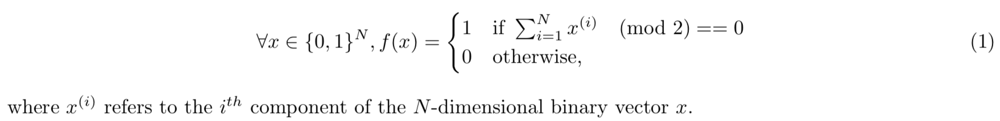
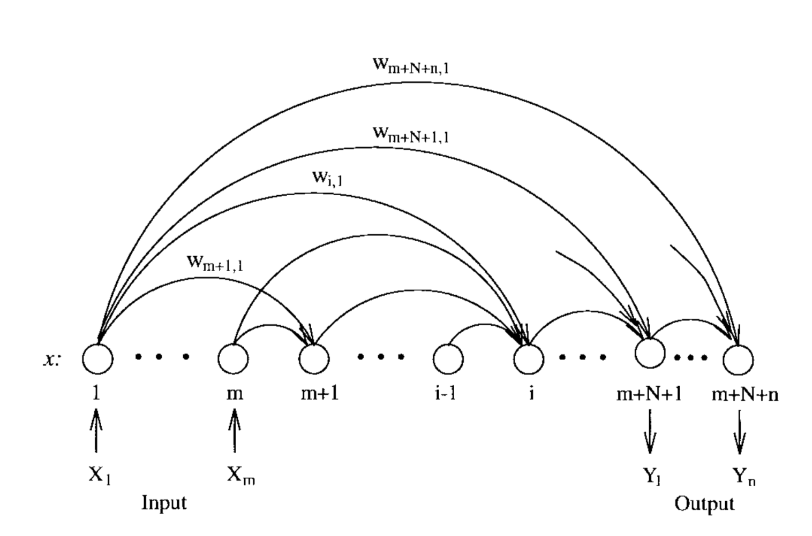

# Evolving Artificial Neural Networks

This repository is dedicated for the 1st course project of CS421 Advanced Artificial Intelligence, during the fall semester of 2018. This project is to use evolutionary algorithms to evolve neural networks to solve the 5-Parity Problem.


## 1. Introduction

The main task of this assignment is to evolve artificial neural networks (ANNs) for the *5-Parity* problem. The ANNs are famous for their properties of fitting any non-linear function. The work presented in this report is a modificiation of the paper [1] publishied by Yao and Liu. They adopted a evolutionary strategy to change the structure (e.g. number of nodes, connections) of the ANNs in order to produce some better results. This report will be divided into four parts. The second part will involve the detailed description of the algorithm. Several sub-parts will follows, introducing the procedure of each sub-components of the whole algorithm. Then I will present the experimental results and some parameter settings. Finally, the conclusion and future works.


###1.1 The *N-Parity Problem*

The *N-Parity problem* takes a *N*-dimensional binary vector as input and returns 1 or 0 depending on weather
the vector has an even number of 1s or not. A more formal definition is illustrated as follows:



In this assignment, we only consider *N = 5*, which is the *5-Parity Problem*.


## 2. Algorithm Design

### 2.1 Overview

An EP algorithm, which does not use crossover, is adopted in this network evolving process. This algorithm is similar with EPNet [1] by Yao and Liu, but the implementation details and design are slightly different.

First, a certain number of ramdomly generated ANNs are trained with $K_0$ epochs separately. If the individual's error is reduced significantly, this individual is marked with *success*, otherwise *failure*. Then the evolution starts until a stopping criteria is met or the generation number reaches the user-defined limit.

First choose one individual (or called "parent") from the population, based on the error calculated on the validation set. If it is marked with *success*, then do the training with $K_1$ epochs to get a offspring. Accept this offspring and start the next generation. If it is marked with *failure*, then discard the offspring and do the following mutation on the parent. 

For the mutation part, four types of mutations are adopted: nodes deletion, connections deletion, connections addition, nodes addition. They are performed in the above-mentioned order, prefering deletion over addition. After each operation, the offspring is trained for $K_2$ epochs. If the error is not reduced, then we discard this offspring and move on to the next mutation operation. For instance, we first perform nodes deletion on the parent to get an offspring, and the offspring failed to reduce the error. Then we discard the offspring and perform connections deletion to the parent. If the error is reduced, then we accept this offspring and continue the next generation. In the last two mutation stages, the connections addition and nodes addition, this two operation is performed concurrently, yeilding two offspring -- one with connections added and another with nodes added. The two offsprings are compared based on their error. The one with lower error is accepted and we replace the worst one in the population with it.

However, if the individual is full in connection or the number of hidden nodes reaches its maximum. As long as there is one offspring being produced, we will accept it. If both the two addition opeartion failed, we will use Simulated Annealing to train this ANN. If the error is reduced, then the offspring will be accepted. Otherwise, no change will be made, and the next genearation will start.


###2.2 Encoding and Implementation

####2.2.1 ANN Representation


The network I use is a fully connected feedforward network as shown in Fig. 1.



​						Fig. 1 A fully connected feedforward ANN

The calculation for a given input is:
$$
\begin{align*}
& x_i=X_i,				&& 1\le i\le m \\

& net_i = \sum_{j=1}^{i-1}w_{ij}x_j,	&& m<i \le m+N+n \\

& x_j = f(net_j),		&& m<j\le m+N+n \\

& Y_i=x_{i+m+N}, 		&& 1\le i \le n \\
\end{align*}
$$


where $f$ is an activation function which is a sigmoid function:

$$
f(z)=\frac{1}{1+e^-z}
$$


$m$ and $n$ are the number of input and output respectively. $N$ is the number of hidden nodes. 

In the real content, the linear transformation at each node should involve a bias term $b_i$, which looks like 	

$$
net_i = \sum_{j=1}^{i-1}w_{ij}x_j+b_i
$$
Instead of using a bias matrix $W_{bias}$ for each node serperately. I add an additional input node to the network, with its input always being 1, and place it at the beginning of the ANN, say $X_1$. This is equvalent with adding a bias matrix [2].

#### 2.2.2 Data Structures

To represent the whole complex ANN in a polite manner, I use several simple data structure to store all the information needed.

Two matrices are maintained to record the essential information about connectivity and weight. I only use the lower triagular part of the two matrices. To define the dimension of the matrixes, we need to first specify the number of hidden nodes $N$. The maximum number of hidden nodes the network can possess is defiend by the user, denoted by $N_{user}$, and $N_{user} \ge N$.  As mentioned before, an additiional bias node is added to the network. The total dimension we need is $dim = m+1+N_{user}+n$. The $dim\times dim$ connectivity matrix only contains value of 1 or 0 to represent the validity of the connection. The $dim \times dim$ weight matrix will record the weight of each connection. 

In addition, a list for the existence of hidden node is also introduced. For calculation convenience in backpropagation, the hidden nodes will only be arranged at the beginning of the list. For example, if the ANN has 3 hidden nodes, and the allowed maximum node number is 5, the list will be represented as 

$[1,1,1,0,0]$ and will not be $[1,0,1,0,1]$ or any other sequence. Although the nodes are generated ramdomly at random places, if the sequence is like $[1,0,1,0,1]$, a new node will be added at one of the two 0s, the computation is hard for feedforward and backpropagation. The calculation for feedforward is from the left most node to the right most node, this newly added node should be larger in index, but it is in the middle of the sequence. This will cause confusion.


#### 2.2.3 Fitness Evaluation

The fitness of each individual in this algorithm solely determined by the error value defined as follows:

$$
E=\frac{100}{T\times n} \sum_{t=1}^{T}\sum_{i=1}^{n}(\hat Y_i(t)-Y_i(t))^2 
$$
where $T$ is the validation set, $\hat Y(t)$ is  the ANN's actural output over validation case $t$, $Y_i(t)$ is the desired output. 

####2.2.4 Selection Mechanism

The selection is based on error calculated in section 2.2.3. Let $M$ sorted individuals be numbered as 
$0,1,...,M-1$ , with the zeroth being the fittest. Then the $j$ th individual is selected with probablility 
$$
P(j) = \frac{M-j}{\sum_{k=1}^{M}k}
$$
Then the probability to be selected will be linearly decresing accroding to the fitness.

#### 2.2.5 Training Method

In this assignment, classical backpropagation algorithm and simulated anneilling are used to reduce the error. The ANNs used in this assignment is not the conventional network with several  "layers". The calculation for the gradient follows the procedures in [2].

Simulated anneilling is famous for its global search ability and does not have the shortcoming of reaching a local minimum. However, it is relatively slow to converge and I use it only when other operations all fail to improve the ANNs.

####2.2.6 Architecture Mutations


1. The number of nodes to be deleted is determined randomly with a upper bound given by the user. After deletion, the list for maintaining the validity of hidden nodes, the connectivity matrix and the weight matrix must be rearranged to keep the valid nodes at the beginning.

   For example, delete the node at the 5th row and column:

   ```
   connectivity matrix:
   before:						after:
   [ 0 0 0 0 0 0 0 ]			[ 0 0 0 0 0 0 0 ]
   [ 0 0 0 0 0 0 0 ]			[ 0 0 0 0 0 0 0 ]
   [ 0 0 0 0 0 0 0 ]			[ 0 0 0 0 0 0 0 ]
   [ 1 1 1 0 0 0 0 ]			[ 1 1 1 0 0 0 0 ]
   [ 1 1 1 1 0 0 0 ]			[ 1 1 1 0 0 0 0 ]<--
   [ 1 1 1 1 1 0 0 ]<--		[ 0 0 0 0 0 0 0 ]
   [ 1 1 1 1 1 1 0 ]			[ 1 1 1 1 1 0 0 ]
   
   clear the 5th column and row, then
   move the 6th column and row to the 5th. 
   ```


2. The connection deletion is conducted based on the *importance* of each connection [3]. The *importance* is defined as

   $$
   test(w_{ij})=\frac{\sum_{t=1]}^T \xi_{ij}^t }{\sqrt{\sum_{t=1}^{T}(\xi_{ij}^t-\bar{\xi_{ij}})^2}}
   $$


   where $\xi_{ij}^t = w_{ij}+\Delta w_{ij}^t(w)$ , $w_{ij}$ is the weight of conection from *j* to *i*, and $\bar{\xi_{ij}}$ denotes the average over the set $\xi^t_{ij}, t=1,...,T$.

   The connection with large $test$ value will deleted with higher pobability. The calculation of this value is during the training process.

3. Connection addition is based on the *importance* value denoted above as well.

4. Node addition is implemented through splitting an existing hidden node, a process called “cell division”.

   The weights after, denoted by $\bold{w^1}$ and $\bold{w^2}$ has the following relationship with the original weight $\bold{w}$ :

   $$
   \begin{align*}
   & w_{ij}^1=w_{ij}^2=w_{ij},  & i\ge j \\
   
   & w_ki^1=(1+\alpha)w_ki,  & i<k \\
   
   & w_{ki}^2=-\alpha w_{ki},  & i<k
   \end{align*}
   $$


#### 2.2.7 Error Tolerance 

The accepting criteria for each mutaion stage is not so strict. For example, in the node deletion, as long as the error difference between the parent and offspring is larger than $-k$ times the previous error, where $k$ is a small positive number, the offspring can be accepted.

$$
\begin{align*}
&{error\_before}- error\_after > {-k}\times{error\_before}, \\
&k\ can\ be\ 0.08
\end{align*}
$$


### 3. Experimental Studies

The experiment is conducted 10 times with the following parameters:

| population size | $K_0$ | $K_1$ | $K_2$ | initial connecion density | cell division $\alpha$ | max num of connection addition | max num of connection deletion |
| --------------- | ----- | ----- | ----- | ------------------------- | ---------------------- | ------------------------------ | ------------------------------ |
| 20              | 1000  | 500   | 100   | 0.98                      | -0.4                   | 3                              | 2                              |

| max num of node deletion | BP learning rate | BP learning rate range | SA initial T | SA epochs each T | SA final T |
| ------------------------ | ---------------- | ---------------------- | ---- | ---- | ------------ | ---------------- | ---------- |
| 2                        | 0.5              | 0.1-0.6                | 3000         | 100              | 5          |

|                     | Min    | Max  | Mean   | SD     |
| ------------------- | ------ | ---- | ------ | ------ |
| Num of hidden nodes | 2      | 5    | 4.3    | 1.005  |
| Num of connections  | 35     | 50   | 44     | 5.385  |
| Num of generations  | 100    | 100  | 100    | 0      |
| Error of Networks   | 0.0129 | 1.29 | 0.2494 | 0.4123 |

The stopping criteria is that the network perform correct on each of the problem and the number of hidden nodes is less than 3.

| T           | 1           | 2           | 3           | 4           | 5           | 6           | 7           | 8           | 9           |
| ----------- | ----------- | ----------- | ----------- | ----------- | ----------- | ----------- | ----------- | ----------- | ----------- |
| -7.33182479 | 4.98101002  | 4.93042111  | 4.50997744  | -5.33069769 | -5.35480917 |             |             |             |             |
| -1.3500198  | 2.44757875  | 2.27606457  | -2.04730354 | -2.49845599 | -2.792388   | 0.26999308  |             |             |             |
| -3.35400254 | -6.5050135  | -6.57151375 | -7.21654699 | 6.56504007  | 6.40746501  | -3.59931682 | -3.13115392 |             |             |
| 5.31609984  | -2.47926047 | -2.54327602 | -2.08825755 | 3.15467233  | 3.07972108  | 6.13793185  | -0.6731663  | -4.84237919 |             |
| -0.81069537 | -3.76557279 | -3.6551334  | -5.67770207 | 2.74649941  | 2.83441166  | 9.15476618  | 1.65076711  | -9.35709831 | 11.30152302 |

### 4. Conclusion

Due to the complexity of the assignment, the result varies on different runs. If time is plenty, the Adam method for training can be used. The evolution strategy can also be refined to raise efficiency.


### 5. References

[1]A New Evolutionary System for Evolving Artificial Neural Networks

[2]Backpropagation Through Time: What It Does and How to Do It

[3]Improving Model Selection by Nonconvergent Methods

